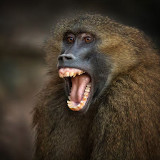

# ASNVis

ASNViz is a multimedia analytics solution that facilitates the visualization and analysis of animal social networks (ASNs). By modeling ASNs as networks of nodes and edges, ASNViz provides valuable insights into the dynamics and evolution of animal communities. The tool quantifies and visualizes the social structure at node and network levels, predicts future interactions when new individuals are added using deep-learning, and allows for manual updates based on empirical observations.

<center>

</center>

## Installation Guide

Our solution does not require the use of GPU, enabling plug and play accessibility to a wide range of computer setups.

### Step 1: Clonining
This repository consists the [asnr](https://github.com/bansallab/asnr) [1] repository as a submodule, therefore you will need recurisve strategy:
```
git clone --recursive git@github.com:madhurapawaruva/animalsocialnw_team7.git
cd animalsocialnw_team7
```
If you have already cloned the repository, you can also download the submodule afterwards:
```
git submodule update --init
```

### Step 2: Environment

Conda:
```
conda env create -f env.yml
conda activate t7ma
```
Pip:
```
pip install -r requirements.txt
```

## Run
```
python app.py
```

## Available social graphs


| **Animal**   | Barn Swallow                                                                                        | Songbird                                                                                         | Sparrow                                                                                             | Ants                                                                                       | Beetle                                                                                       | Baboon                                                                                         | Bats                                                                                         | Bison                                                                                       | Ground Squirrel                                                                                        | Mouse                                                                                                         | Rhesusmacaque                                                                                         |
| ------------ | --------------------------------------------------------------------------------------------------- | ------------------------------------------------------------------------------------------------ | --------------------------------------------------------------------------------------------------- | ------------------------------------------------------------------------------------------ | -------------------------------------------------------------------------------------------- | ---------------------------------------------------------------------------------------------- | -------------------------------------------------------------------------------------------- | ------------------------------------------------------------------------------------------- | ------------------------------------------------------------------------------------------------------ | ------------------------------------------------------------------------------------------------------------- | ----------------------------------------------------------------------------------------------------- |
| **Taxonomy** | Aves                                                                                                | Aves                                                                                             | Aves                                                                                                | Insecta                                                                                    | Insecta                                                                                      | Mammalia                                                                                       | Mammalia                                                                                     | Mammalia                                                                                    | Mammalia                                                                                               | Mammalia                                                                                                      | Mammalia                                                                                              |
| **Image**    |  |  |  |  |  |  |  |  |  |  |  |

## References

[1] Sah, P., Collier, M., Ali, S., David Mendez, J., & Bansal, S. (2020). Animal Social Network Repository (Version 2.0) [Data set]. https://github.com/bansallab/asnr